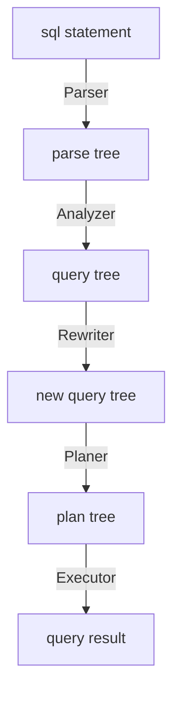

# query process




# show execution plan
```sql
-- use `explain` with sql statement
explain select * from foo;

-- explain plan for actual execution of sql statement
explain analyze select * from foo;

-- rollback the side effects
begin;
explain analyze drop table foo;
rollback;
```


# change execution plan
```sql
-- Set the value of the parameter "enable_seqscan" to "off"
SET enable_seqscan = off;

-- Run a query that uses a sequential scan
SELECT * FROM my_table WHERE column1 = 'value1';

-- Set the value of the parameter "enable_indexscan" to "on"
SET enable_indexscan = on;

-- Run the same query again, but this time use an index scan
SELECT * FROM my_table WHERE column1 = 'value1';
```